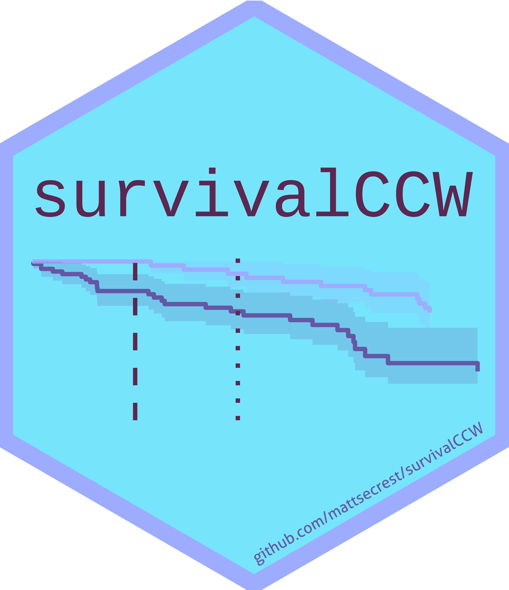

# survivalCCW 

<!-- badges: start -->

<!-- badges: end -->

This is a work-in-progress package that conducts clone censor weight analyses in R. Please use at your own risk. Consider filing a bug report or reaching out to [Matt](mailto:secrmatt@gmail.com) for questions/comments/suggestions.
